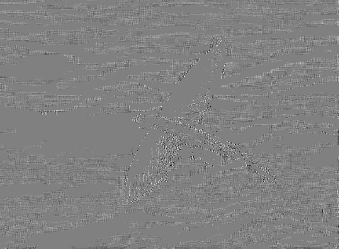
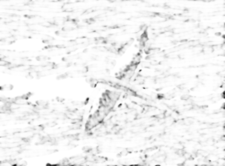

# JPEGsrc Codec

A simple implementation of the algorithm JPEG encoder/decoder.

 

## Dependencies

- [Opencv](https://opencv.org/) Opencv package utilized in reading/show of images and conversion of colors spaces ***RGB*** to ***YCbCr***.
- [Bitstring](https://pypi.python.org/pypi/bitstring/3.1.3) package used to convert the coefficients of the DCT transform. 

## Usage

Just run the main file.

    python main.py
 
## Outputs

Generates a generic text (and large) file '.huff' in 'output/' with the binary stream.
Coputes some compression information like: compression rate, data redundancy, total number of bits.
At the end the image quality is measured by performing the Structural Similarity Index are performed.

## Exemples

|  |  |
|:------------------------------------:|:--------------------------:|
| *Original image* | *Rescued image* |
|  |  |
| *Diference image (luma)* | *Similarity map* |
